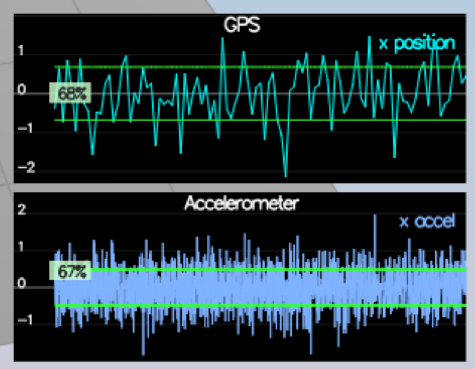
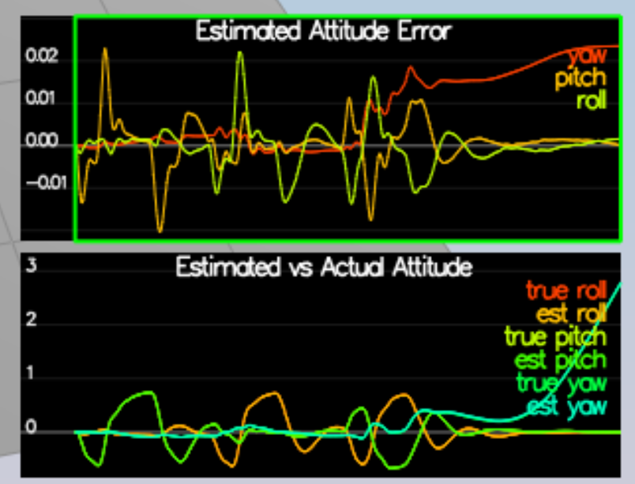
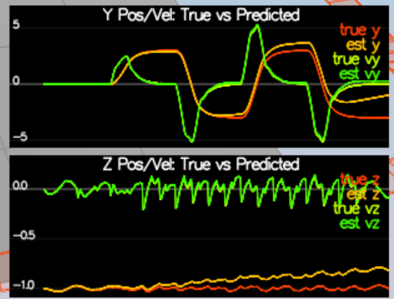
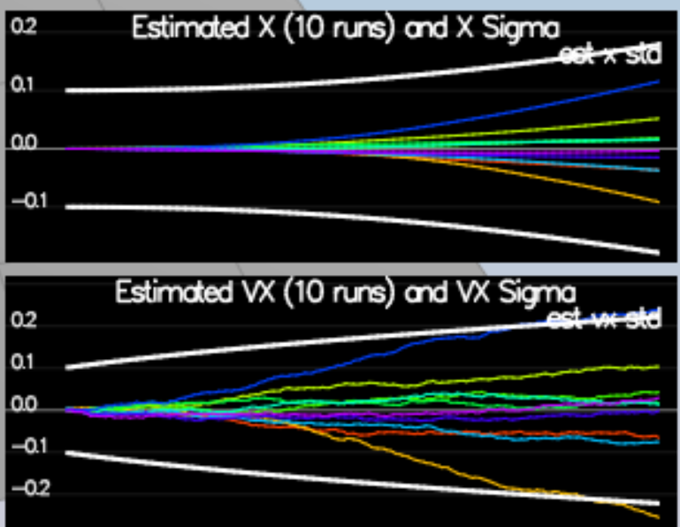
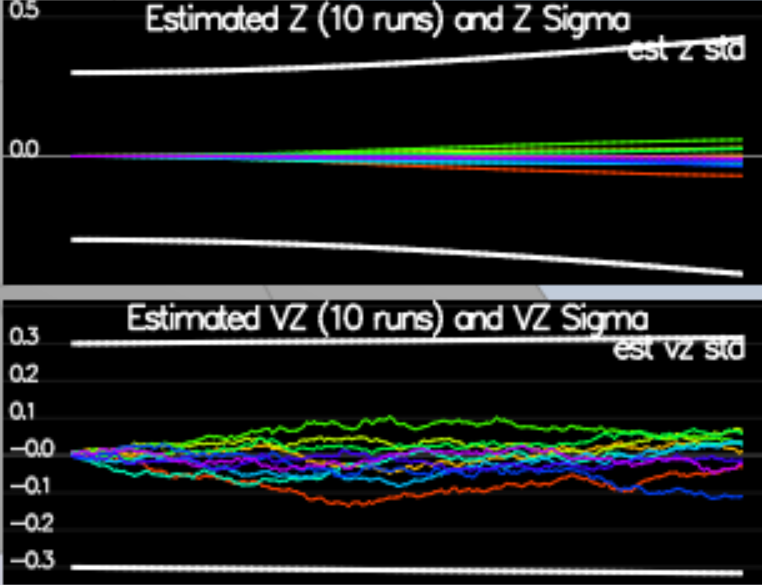
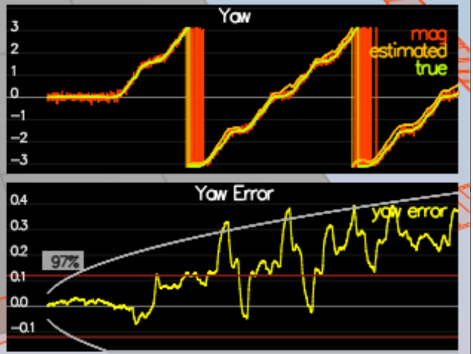
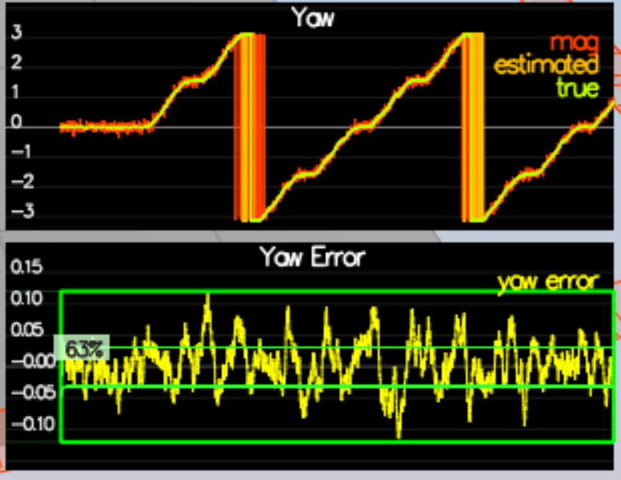
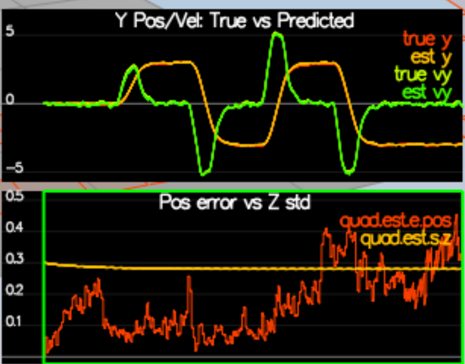
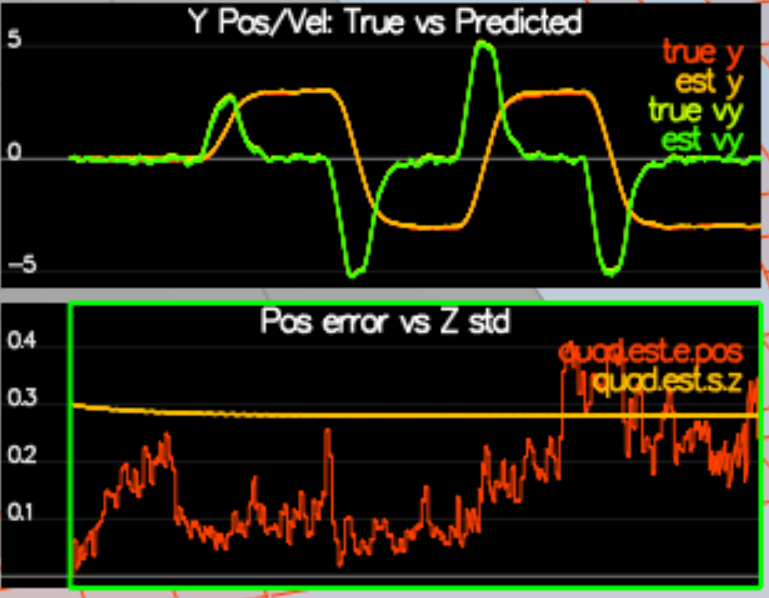
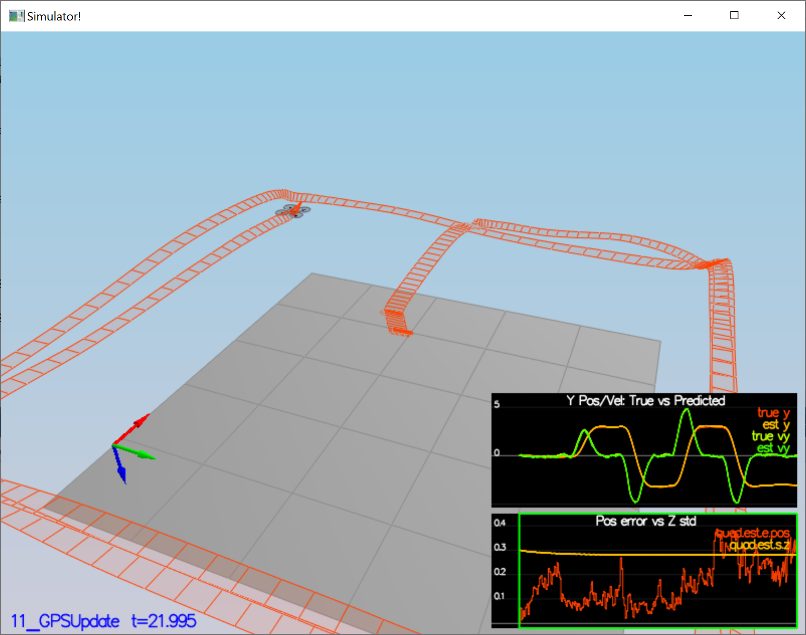

# Estimation Project #
### Step 1: Sensor Noise ###

> 2. Choose scenario `06_NoisySensors`.  In this simulation, the interest is to record some sensor data on a static quad, so you will not see the quad move.  You will see two plots at the bottom, one for GPS X position and one for The accelerometer's x measurement.  The dashed lines are a visualization of a single standard deviation from 0 for each signal. The standard deviations are initially set to arbitrary values (after processing the data in the next step, you will be adjusting these values).  If they were set correctly, we should see ~68% of the measurement points fall into the +/- 1 sigma bound.  When you run this scenario, the graphs you see will be recorded to the following csv files with headers: `config/log/Graph1.txt` (GPS X data) and `config/log/Graph2.txt` (Accelerometer X data).
> 3. Process the logged files to figure out the standard deviation of the the GPS X signal and the IMU Accelerometer X signal.
> 4. Plug in your result into the top of `config/6_Sensornoise.txt`.  Specially, set the values for `MeasuredStdDev_GPSPosXY` and `MeasuredStdDev_AccelXY` to be the values you have calculated.
> 5. Run the simulator. If your values are correct, the dashed lines in the simulation will eventually turn green, indicating you’re capturing approx 68% of the respective measurements (which is what we expect within +/- 1 sigma bound for a Gaussian noise model)
> ***Success criteria:*** *Your standard deviations should accurately capture the value of approximately 68% of the respective measurements.*


Done as instructed, code to calculate the estimates is in `src/sensor_noise_estimates.py`, see screenshot above.

### Step 2: Attitude Estimation ###
> 2. In `QuadEstimatorEKF.cpp`, you will see the function `UpdateFromIMU()` contains a complementary filter-type attitude filter.  To reduce the errors in the estimated attitude (Euler Angles), implement a better rate gyro attitude integration scheme.  You should be able to reduce the attitude errors to get within 0.1 rad for each of the Euler angles, as shown in the screenshot below.

Done, see screenshot below. I love quaternions!



### Step 3: Prediction Step ###
> 2. In `QuadEstimatorEKF.cpp`, implement the state prediction step in the `PredictState()` functon. 
If you do it correctly, when you run scenario `08_PredictState` you should see the estimator state track the actual state, with only reasonably slow drift.

Done - see screenshot below.


> 4. In `QuadEstimatorEKF.cpp`, calculate the partial derivative of the body-to-global rotation matrix in the function `GetRbgPrime()`.  Once you have that function implement, implement the rest of the prediction step (predict the state covariance forward) in `Predict()`.
> 5. Run your covariance prediction and tune the `QPosXYStd` and the `QVelXYStd` process parameters in `QuadEstimatorEKF.txt` to try to capture the magnitude of the error you see. Note that as error grows our simplified model will not capture the real error dynamics (for example, specifically, coming from attitude errors), therefore  try to make it look reasonable only for a relatively short prediction period (the scenario is set for one second).  A good solution looks as follows:

Done, see below: 


Also did it for the Z errors and estimated covariance, which was very helpful as it let me catch
a bug in how I was updating the variance:



### Step 4: Magnetometer Update ###
> 1. Run scenario `10_MagUpdate`.  This scenario uses a realistic IMU, but the magnetometer update hasn’t been implemented yet. As a result, you will notice that the estimate yaw is drifting away from the real value (and the estimated standard deviation is also increasing).  Note that in this case the plot is showing you the estimated yaw error (`quad.est.e.yaw`), which is drifting away from zero as the simulation runs.  You should also see the estimated standard deviation of that state (white boundary) is also increasing.
> 2. Tune the parameter `QYawStd` (`QuadEstimatorEKF.txt`) for the QuadEstimatorEKF so that it approximately captures the magnitude of the drift, as demonstrated here:

Done, my screenshot: 


> 3. Implement magnetometer update in the function `UpdateFromMag()`.  Once completed, you should see a resulting plot similar to this one:

Done, screenshot below:


### Step 5: Closed Loop + GPS Update ###
Ah, that was the hard one ;)

> 1. Run scenario `11_GPSUpdate`.  At the moment this scenario is using both an ideal estimator and and ideal IMU.  Even with these ideal elements, watch the position and velocity errors (bottom right). As you see they are drifting away, since GPS update is not yet implemented.
> 2. Let's change to using your estimator by setting `Quad.UseIdealEstimator` to 0 in `config/11_GPSUpdate.txt`.  Rerun the scenario to get an idea of how well your estimator work with an ideal IMU.
> 3. Now repeat with realistic IMU by commenting out these lines in `config/11_GPSUpdate.txt`:
```
#SimIMU.AccelStd = 0,0,0
#SimIMU.GyroStd = 0,0,0
```
> 5. Implement the EKF GPS Update in the function `UpdateFromGPS()`.
> 6. Now once again re-run the simulation.  Your objective is to complete the entire simulation cycle with estimated position error of < 1m (you’ll see a green box over the bottom graph if you succeed).  You may want to try experimenting with the GPS update parameters to try and get better performance.


At this point, congratulations on having a working estimator!

### Step 6: Adding Your Controller ###
> 1. Replace `QuadController.cpp` with the controller you wrote in the last project.

Just getting this to run with the control parameters from the previous section let me find
a couple of bugs in my code ;). Resulting run below:



> 2. Replace `QuadControlParams.txt` with the control parameters you came up with in the last project.
> 3. Run scenario `11_GPSUpdate`. If your controller crashes immediately do not panic. Flying from an estimated state (even with ideal sensors) is very different from flying with ideal pose. You may need to de-tune your controller. Decrease the position and velocity gains (we’ve seen about 30% detuning being effective) to stabilize it.  Your goal is to once again complete the entire simulation cycle with an estimated position error of < 1m.

And after much trial and error, that worked! I'm surprised that I had to relax `kpPosXY` by over an order of magnitude!

